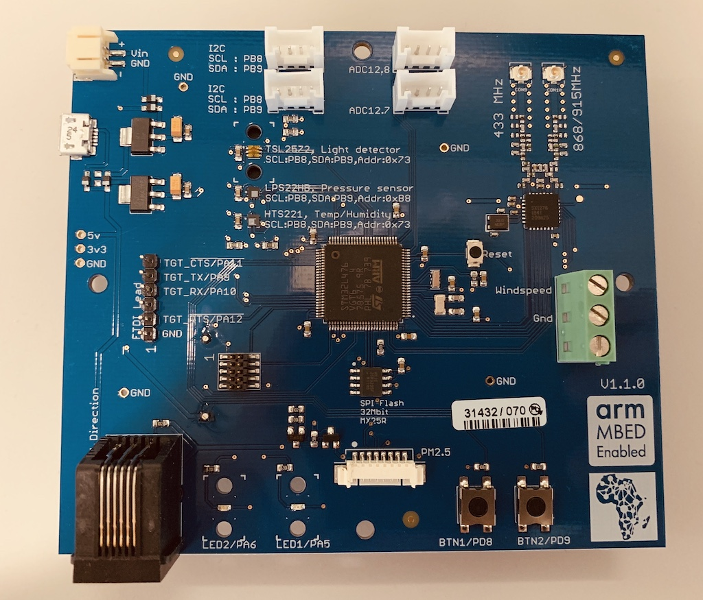

# DSA 2019 Board Introduction

This repo gives an introduction to the DSA 2019 board developed by Chris Styles at ARM. For a deep dive, see [Jan Jongboom's repo](https://github.com/janjongboom/dsa-firmware-2019).



The board contains a number of sensors as listed in Jan's repo. They are

* STM32L475VG MCU.
* SX1276 LoRa radio.
* TSL2572 light sensor.
* LPS22HB barometric pressure sensor.
* HTS221 temperature / humidity sensor.
* Connector for PMS5003 particle monitor.
* Connector for Davis anemometer.
* 2 buttons.
* 2 LEDs.
* 4 Grove connectors, one is used for soil moisture.
* Battery holder at the back (4x AA).

We will explore these sensors and send data over LoRaWAN. We will explore the following applications.

The three applications are
1. The hardware hello world program *Blinky* that turns an LED on and off.
1. Temperature and humidity sensor
1. Data transmission using LoRaWAN

## Set Up
To compile code for the board, we will use the command line tool. [See these instructions](https://os.mbed.com/docs/mbed-os/v5.12/tools/installation-and-setup.html) to install Mbed CLI.


## Download the code
Clone this repository and its dependencies:

    ```
    $ mbed import https://github.com/janjongboom/dsa-firmware-2019
    ```

## Hello World
To build the hello world application, run:

    ```
    $ mbed compile -m DISCO_L475VG_IOT01A -t GCC_ARM
    ```
After compilation, transfer the the `.bin` file to the board. You should now see LED 1 blinking.
## HTS221 Temperature and Humidity Sensor

The HTS221 is a [capacitive temperature and humidity sensor](https://www.st.com/en/mems-and-sensors/humidity-sensors.html). We import its driver [here](https://os.mbed.com/teams/ST/code/HTS221/) by running.

```
mbed add https://os.mbed.com/teams/ST/code/HTS221/#9f317607860e
```

Where the revision number `#9f317607860e` is obtained from [this page](https://os.mbed.com/teams/ST/code/HTS221/)

This [example program](https://os.mbed.com/teams/ST/code/HelloWorld_ST_Sensors/file/55795f30572e/main.cpp/) from ST shows how to interact with the sensors
